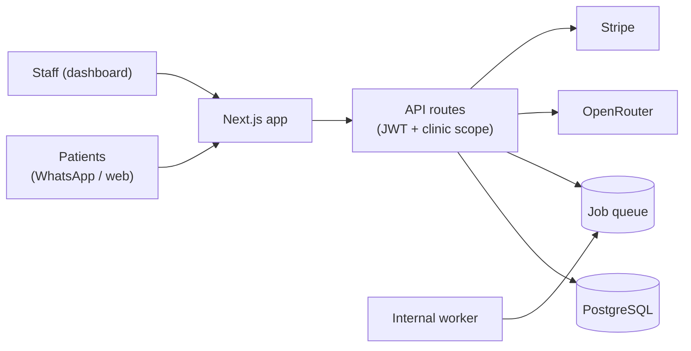

<div align="center">


# Clinot AI

### AI-powered dental clinic management and patient communication

[](https://github.com/akarshit819/ClinotAi/actions/workflows/ci.yml)


Clinot brings dental clinic operations, patient communication, appointments, and AI-assisted reception
into one workspace — over WhatsApp and the website. Staff confirm everything; nothing is auto-confirmed.

[Live Demo](https://clinot-ai.onrender.com) ·
[Documentation](docs/ARCHITECTURE.md) ·
[Architecture](docs/ARCHITECTURE.md) ·
[AI](docs/AI.md) ·
[Security](docs/SECURITY.md) ·
[Roadmap](ROADMAP.md) ·
[Changelog](CHANGELOG.md)

</div>

## What is Clinot?

Dental front desks answer the same questions all day — hours, pricing, insurance, availability — while new
patient inquiries arrive after hours over WhatsApp and the website. Clinot AI centralizes that work: one
clinic workspace with patient records, appointment requests, a shared conversation inbox, and an AI
receptionist that handles routine communication and hands organized requests to the team for confirmation.

Nothing is auto-confirmed without staff approval. The AI is a receptionist, not a clinician: it gives no
diagnoses and escalates symptoms and emergencies to humans.

<div align="center">

## Product Preview

</div>

> Real screenshots are pending manual capture (this environment has no browser tooling; fabricated
> screenshots are forbidden). The exact capture list lives in
> [docs/screenshots/README.md](docs/screenshots/README.md) — dashboard, appointments, patients, inbox,
> AI chat, and integrations.

## Features (all verified in source)

| 🗓️ Appointments | 👥 Patients | 💬 Inbox |
| --- | --- | --- |
| Deterministic booking state machine, slot filling, duplicate protection, soft-delete, cancel notifications. | Records linked to conversations, appointments, and leads. | Multi-channel conversations with statuses, unread counts, and staff replies. |

| 🤖 AI Receptionist | ✉️ Messaging | 💳 Billing |
| --- | --- | --- |
| 10-route deterministic router, dental-domain allowlist with typo tolerance, guardrails, OpenRouter failover, DB-backed fallbacks. | WhatsApp (verified webhooks, idempotent queue, rate-limited send), Messenger/Instagram connectors, website chat + widget. | Stripe plans, checkout/portal, 9 webhook handlers, history, feature gating. |

| 🏥 Clinic Workspace | 🔐 Authentication & Security | 📊 Knowledge & Analytics |
| --- | --- | --- |
| Profile, hours, services, FAQs/knowledge base, branding, timezone-aware booking. | Custom JWT + DB sessions, argon2id passwords, clinic-scoped queries, CSRF/CSP/HSTS, verified webhooks, redacted audit log. | Clinic knowledge management, per-clinic AI usage tracking, analytics aggregations. |

Details: [docs/SECURITY.md](docs/SECURITY.md).

## Architecture

Single-service monolith: Next.js → API routes → PostgreSQL (Prisma), with a Postgres-backed job queue and an
internal worker in the same boot unit. No Redis, no separate services.



<div align="center">

**Architecture → [docs/ARCHITECTURE.md](docs/ARCHITECTURE.md)**

</div>

## AI Receptionist

Deterministic routing first (emergency → booking → clinic info → symptoms → general), guardrails second,
OpenRouter with env-driven primary + fallback models third, DB-backed fallback always. RAG retrieval and LLM
tool-calling code exists but is **not** wired into the production path. AI output can be inaccurate; staff
review applies, especially for medical concerns.

<div align="center">

**AI system → [docs/AI.md](docs/AI.md)**

</div>

## Technology Stack

<div align="center">


</div>

| Layer | Choice |
|---|---|
| Framework | Next.js 14, React 18, TypeScript (strict) |
| Styling | Tailwind CSS, lucide-react |
| Database | PostgreSQL via Prisma 5 (migrations) |
| Auth | Custom JWT + sessions, argon2id/bcrypt |
| AI | OpenRouter gateway (single provider path) |
| Messaging | Meta Graph API, website widget |
| Billing | Stripe |
| Email | Nodemailer + Resend |
| Quality | Vitest (633 tests), ESLint, Prettier, GitHub Actions |

## Project structure

```text
src/app/            # site, auth, dashboard pages + 46 API routes
src/components/ src/hooks/ src/contexts/
src/lib/            # auth, db, env, ai/, appointment/, billing/, jobs/, security/
src/messaging/      # engine, pipeline, AI receptionist, inbox, notifications
src/integrations/   # whatsapp/messenger/instagram connectors, token store
prisma/             # schema.prisma, migrations/
scripts/            # start-production.js, postbuild.js, import tooling
tests/              # 30 vitest files
docs/               # architecture, AI, security, deployment, reports
```

## Getting started

```bash
npm install
npm run setup     # Prisma generate + local db push + seeds (local throwaway DB only)
npm run dev       # http://localhost:3000
```

Local demo login (dev only): `admin@clinot.ai` / `admin123`.

## Environment variables

| Variable | Required | Purpose |
|---|---|---|
| `DATABASE_URL` | Prod: yes | PostgreSQL connection string |
| `JWT_SECRET` / `ENCRYPTION_KEY` / `CSRF_SECRET` | Prod: yes, 32+ chars | Signing, credential encryption, CSRF |
| `NEXT_PUBLIC_APP_URL` | Prod: yes | Exact public URL (CSRF, emails, OAuth, webhooks) |
| `META_APP_SECRET` / `WA_WEBHOOK_SECRET` | For inbound messaging | Webhook verification |
| `STRIPE_SECRET_KEY` (+ price/webhook secrets) | For billing | Stripe API + webhooks |
| `OPENROUTER_API_KEY` / `OPENROUTER_MODEL` | For live AI | Provider key + primary model |
| `RESEND_API_KEY` / `FROM_EMAIL` | For auth emails | Password/email delivery |
| `WHATSAPP_*` (3 vars) | For auto-provisioning | Link WhatsApp at boot |
| `CLINOT_BOOTSTRAP_ADMIN` + `BOOTSTRAP_ADMIN_*` | First boot only | Initial owner; remove after login |

See [.env.example](.env.example) and [docs/DEPLOYMENT.md](docs/DEPLOYMENT.md). Never commit `.env`.

## Development

```bash
npm run dev         # local server
npm run typecheck   # tsc --noEmit
npm run lint        # next lint
npm run format      # prettier --write (check: format:check)
npm run test        # vitest (hermetic, no live provider calls)
npm run build       # production build + standalone output
```

Database: `db:generate`, `db:migrate:dev` (local), `db:migrate:deploy` (production only),
`db:seed:system` (idempotent), `db:seed:dev` / `db:seed:whatsapp` (opt-in). Never `db:push` outside local dev.

## Deployment

One web service + one managed Postgres. Boot runs migrations, seeds, then the internal worker + Next.js server.
Providers: Railway, Render, Voroa. Details: [docs/DEPLOYMENT.md](docs/DEPLOYMENT.md),
[docs/RENDER-DEPLOYMENT.md](docs/RENDER-DEPLOYMENT.md). Health: `GET /api/health`.

## Security

> Security is treated as a foundation of Clinot, with verified sessions, clinic-scoped tenant isolation,
> CSRF protection, CORS controls, security headers, webhook verification, redacted audit logging, and
> security-focused testing. Limitations are documented, not hidden.

Full: [docs/SECURITY.md](docs/SECURITY.md). Report issues privately per [SECURITY.md](SECURITY.md).
No compliance certifications are claimed.

## Current Status

Pre-release (`v0.1.0` proposed, not tagged — see [CHANGELOG.md](CHANGELOG.md)).

Working: clinic workspaces, auth/RBAC model, appointments, patients, inbox, AI receptionist with guardrails and
failover, WhatsApp messaging, website chat, Stripe billing, knowledge base, analytics aggregations, job system,
boot orchestration.

Incomplete or stubbed: Telegram integration (stub webhook — do not enable); Messenger/Instagram tenant mapping;
Instagram webhook secret inconsistency; RAG-to-prompt wiring; LLM tool-calling in production; appointment
booking/notification job handlers; calendar sync (does not exist); per-route role checks (any clinic session can
use clinic features — pending authorization-model decision). Tracked in [ROADMAP.md](ROADMAP.md).

No production usage, customers, revenue, uptime, SLA, or compliance certifications are claimed.

## Documentation

| Documentation | | |
| --- | --- | --- |
| [Architecture](docs/ARCHITECTURE.md) | [AI](docs/AI.md) | [Security](docs/SECURITY.md) |
| [Deployment](docs/DEPLOYMENT.md) | [Database](docs/DATABASE.md) | [Audit](docs/GITHUB_PROFESSIONALIZATION_AUDIT.md) |
| [Roadmap](ROADMAP.md) | [Contributing](CONTRIBUTING.md) | [Changelog](CHANGELOG.md) |

## License

No open-source license has been granted yet (`private: true`) — all rights reserved. Options and
recommendation: [docs/LICENSE_DECISION.md](docs/LICENSE_DECISION.md). Do not reuse this code until a
license is chosen.

<div align="center">

Built for modern dental clinics — routine questions answered, appointments captured, team in control.

**Clinot AI** · [Live Demo](https://clinot-ai.onrender.com) · [Documentation](docs/ARCHITECTURE.md)

</div>
