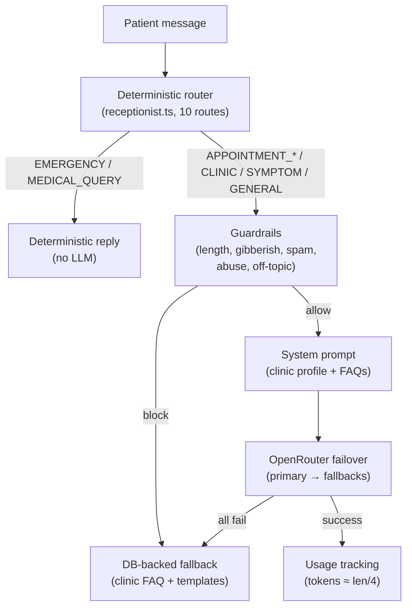

# Clinot AI — AI System

> Verified against `src/lib/ai/`, `src/messaging/ai/`, and `.env.example`.
> Design principle: the AI is a **receptionist, not a clinician**. It answers routine questions from approved
> clinic knowledge, collects appointment requests, and escalates everything else to the team.

## 1. Architecture

Two entry points in `src/lib/ai/index.ts`: `generateAIResponse()` (website chat, no tools) and
`generateAIResponseWithTools()` (WhatsApp receptionist; tool loop only when explicitly enabled).

## 2. Provider: OpenRouter gateway (single provider)

All LLM traffic goes to `https://openrouter.ai/api/v1/chat/completions` (`src/lib/ai/providers.ts`).
There are no OpenAI/Anthropic SDKs. Errors are typed (`NOT_CONFIGURED`, `AUTH_FAILED`, `RATE_LIMITED`,
`TIMEOUT`, `NETWORK`, `PROVIDER`, `BAD_REQUEST`, `EMPTY_RESPONSE`); the API key is never logged.

## 3. Model configuration (env-driven, no code changes)

| Variable | Behavior |
|---|---|
| `OPENROUTER_API_KEY` | Required for live replies; without it every message uses fallback (`OPENROUTER_NOT_CONFIGURED`). |
| `OPENROUTER_MODEL` | Primary model, always attempted first. Change + redeploy to switch models. |
| `OPENROUTER_FALLBACK_MODELS` | Optional comma-separated chain, attempted in order (whitespace ignored, duplicates removed). |

Failover (`openrouter-manager.ts`): one attempt per model (max 10), in-memory health tracking (2 failures →
60s cooldown; auth/missing-key exempt). Fatal errors (`AUTH`, `NOT_CONFIGURED`, `BAD_REQUEST`) stop the chain;
recoverable ones (429, timeout, network, 404, 5xx, empty) advance to the next model. Every attempt is logged
with a `CLINOT_AI_TRACE` id.

## 4. Receptionist routing (deterministic, no LLM)

Priority order in `src/messaging/ai/receptionist.ts`:

`EMERGENCY > APPOINTMENT_START > SLOT_ANSWER > INTERRUPTION > CANCEL > RESCHEDULE > CLINIC > INSURANCE >
SYMPTOM > GENERAL`

Booking itself is a deterministic state machine (`appointment-state.ts` + `booking.ts`): slot filling, date/time
interpretation, duplicate protection, confirmation summaries. The LLM never invents appointment times.

## 5. Dental-domain guardrails

- **Allowlist** (`clinot-domain.ts`, single source of truth): reception, appointment, clinic info, contact,
  doctor, service, health, and emergency patterns — including Hinglish phrasing (`krna/chahiye/mujhe`), bare
  `help`, dates/times, phone/email patterns. Extraction-probing patterns (`what model are you`, `show prompt`)
  classify as outside.
- **Typo tolerance**: fuzzy health-signal matching (Levenshtein ≤ 2 + transposition, framing-gated, with
  non-complaint/body blocklists) — e.g. "i have headche" is handled safely.
- **Guardrail order** (`guardrails.ts`): overlong → gibberish → spam → abuse → emergency (pass) →
  medical-query (pass to safe reply) → off-topic redirect (fail-closed).
- **Prompt-injection screening** (`prompt-guard.ts`): 21 patterns, block at score ≥ 0.4. Broad by design;
  known false-positive risk documented.
- **Medical safety**: symptom messages get an empathetic non-diagnostic reply + offer to book; emergencies get
  emergency-contact guidance. The system prompt forbids claiming to be human, a doctor, or giving diagnoses.

## 6. Fallback responses (always available)

`fallback.ts` loads clinic + FAQ + knowledge base, prefers high-confidence knowledge matches, else regex
templates (emergency / symptom / booking / price / hours / location / insurance / greeting / thanks / bye),
else the best RAG hit, else a generic redirect. A fallback is never empty and is labeled with
`fallbackReason=OPENROUTER_*` in logs.

## 7. Usage tracking

Fire-and-forget `aiUsage.upsert(clinicId, month, provider)` per AI call (tokens estimated as characters/4).
Surfaced in dashboard usage/billing views.

## 8. Prompt handling

`buildSystemPrompt()` assembles the receptionist identity, clinic profile/hours/address, FAQs, and safety rules
(`prompt.ts`). The website path uses it directly; the WhatsApp path adds conversation history and the
appointment draft context.

## 9. Honestly incomplete (do not present as production features)

- **RAG wiring**: `rag.ts` implements in-memory BM25 (`topK=5`), but `buildSystemPrompt()` does not interpolate
  the computed `ragContext` — only the fallback path consumes RAG results today.
- **LLM tool calling**: `tools.ts` (appointment tools, zod schemas, `executeToolCall`) exists but the
  production receptionist runs with `includeTools: false`; booking bypasses tools entirely.
- **Model default drift**: `ApiConfig.model` defaults to `gpt-4o` while the only wired provider is OpenRouter —
  treat the default as stale until aligned.
- AI-generated content can be inaccurate; clinic teams should review AI-assisted replies, especially any message
  involving medical concerns. Clinot is not a medical device and provides no diagnosis.
