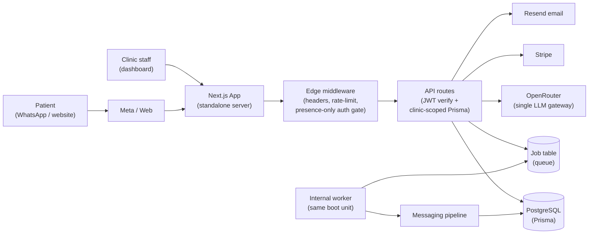

# Clinot AI — Architecture

> Verified against the source at `src/`, `prisma/schema.prisma`, `scripts/start-production.js`, and `next.config.js`.
> See also: [AI](AI.md) · [Security](SECURITY.md) · [Deployment](DEPLOYMENT.md) · [Database](DATABASE.md)

## 1. System overview

Clinot AI is a single-service monolith. One Node.js deployment runs the Next.js web server **and** an internal
background job processor — no separate worker service, no Redis.

## 2. Request flow

1. **Browser page** → Next.js App Router renders React (Tailwind) pages; dashboard pages call same-origin `/api/*`
   with `access_token` cookie.
2. **Meta webhook** (`/api/webhooks/whatsapp|messenger|instagram`) → signature verification → server-side
   clinic resolution → idempotent `Job` row (`PROCESS_INBOUND_MESSAGE`).
3. **API route** → `getClinicId(request)` (`src/lib/api.ts`) verifies the JWT (signature + live session check) and
   derives `clinicId` from the token payload — never from query/body.
4. **Worker** (started by `scripts/start-production.js`, not by `instrumentation.ts` — see §9) polls the `Job`
   table every ~2s, processes inbound messages through `src/messaging/pipeline.ts`, and enqueues outbound
   WhatsApp replies as `SEND_WHATSAPP_MESSAGE` jobs with backoff and stale-job recovery.

## 3. Frontend (`src/app/`, `src/components/`, `src/hooks/`, `src/contexts/`)

- Public site: `src/app/(site)/` (landing, features, pricing, FAQ, contact, legal).
- Auth: `login`, `signup`, `onboarding`, `chat` (website widget page).
- Dashboard: `dashboard/` overview plus `appointments`, `patients`, `inbox`, `knowledge`, `integrations`,
  `analytics`, `api-config`, `settings/ai-providers`, `billing`, `usage`, `widget`, `website-integration`.
- 46 API routes under `src/app/api/` (auth, appointments, inbox, knowledge, leads, integrations, billing,
  messaging ingest, webhooks, health, chat, settings, onboarding, analytics, emergency, dashboard, checkout).

## 4. API layer

- Every business-data route authenticates via `getClinicId()` and scopes every Prisma query by the JWT-derived
  `clinicId` (compound unique keys where relevant, e.g. `clinicId_platform`, `clinicId_provider`).
- Webhook routes are intentionally unauthenticated but secret-protected (HMAC signatures / verify tokens /
  Stripe event construction). OAuth callback uses an HMAC-signed expiring `state` instead of session auth.
- Full per-route table: [Phase 2A report](PHASE_2A_REPORT.md#authenticationtenant-audit).

## 5. Authentication

Custom JWT + DB-session model (no NextAuth), in `src/lib/auth.ts`:

- HS256 tokens (manual base64url + HMAC-SHA256), 15-minute access / 7-day refresh / 30-day session
  (90-day remember-me). Token hashes stored; refresh rotation with family revoke-all.
- Passwords: argon2id primary (`hash-wasm`), bcrypt legacy with automatic rehash on login.
- 5 failed attempts → 15-minute lockout; 10+ character strength rules with upper/lower/digit/special.
- `registerClinic()` runs in two short transactions (Supabase/PgBouncer P2028 mitigation); roles created with
  batch `createMany`.

## 6. Tenant isolation

Application-level `clinicId` foreign keys on every tenant table + `onDelete: Cascade` from `Clinic`.
There is **no Postgres RLS** — isolation depends on every query scoping `clinicId`, enforced by the
`getClinicId()` pattern and covered by the route audit. Known gaps (webhook/audit tables with bare `clinicId`,
`User.email` globally unique) are tracked in the [audit](GITHUB_PROFESSIONALIZATION_AUDIT.md) and
[roadmap](../../ROADMAP.md).

## 7. Database

35 Prisma models, PostgreSQL, 4 additive migrations applied with `prisma migrate deploy` at boot.
Details: [DATABASE.md](DATABASE.md). Import tooling for the legacy SQLite file lives in
`scripts/import-sqlite-to-postgres.ts` (one-time use; `prisma/schema.sqlite.prisma` is stale — do not treat the
app as dual-database).

## 8. Job queue (`src/lib/jobs/queue.ts`)

PostgreSQL `Job` table: `PENDING → PROCESSING → COMPLETED`, or `FAILED` with `1s/5s/30s` backoff, then
`DEAD_LETTER`. `idempotencyKey` is unique (webhook duplicates collapse). `recoverStaleJobs(10m)` reclaims jobs
orphaned by a dead worker. No Redis by design.

## 9. Internal worker (`src/lib/jobs/worker.ts`)

Handles `PROCESS_INBOUND_MESSAGE` → `processIncomingMessage`, and `SEND_WHATSAPP_MESSAGE` → rate-limited send
with stored credentials. Appointment booking/notification job types currently log no-ops. Started in the
production launcher (pure Node script) because Next.js compiles `instrumentation.ts` for the Edge runtime too,
where Node built-ins are unavailable. `src/instrumentation.ts` therefore only validates secrets.

## 10. AI integration

Single provider path (OpenRouter gateway) with env-driven primary + fallback models, deterministic guardrails,
dental-domain allowlist, and DB-backed fallbacks. Full detail: [AI.md](AI.md).

## 11. Messaging integrations (`src/messaging/`, `src/integrations/`)

- Pipeline: `engine.ts` (ingest/webhook/send) → `pipeline.ts` (history + AI + sanitize + notify + send) →
  `ai/receptionist.ts` (10-route deterministic router owning the appointment draft).
- Channels: `website`, `whatsapp`, `messenger`, `instagram` connectors. Telegram has send/parse helpers but no
  pipeline wiring and a stub webhook (see Current Status in [README](../../README.md)).
- WhatsApp is the production path: verify-token GET, HMAC POST, `phoneNumberId` → clinic resolution
  (fail-closed), idempotent job enqueue, rate-limited send.

## 12. Stripe (`src/lib/billing/`)

Full provider implementation: customers, subscription checkout, billing portal, cancel/reactivate/plan-change,
invoices, and 9 webhook handlers with `StripeEvent` idempotency + billing history + emails. Feature gating via
`canProcessMessaging` (lenient: no subscription still allowed).

## 13. Email

`nodemailer` + Resend (`RESEND_API_KEY`/`FROM_EMAIL`) for forgot-password and verify-email delivery. Without
those vars, those flows fail per-request (warn-only at boot).

## 14. Deployment architecture

One web service + one managed Postgres. Boot: `prisma generate` → `migrate deploy` → system seeds → optional
admin/WhatsApp provisioning → internal worker + Next.js standalone server. Details:
[DEPLOYMENT.md](DEPLOYMENT.md) (consolidated) and [RENDER-DEPLOYMENT.md](RENDER-DEPLOYMENT.md) (Render runbook).
